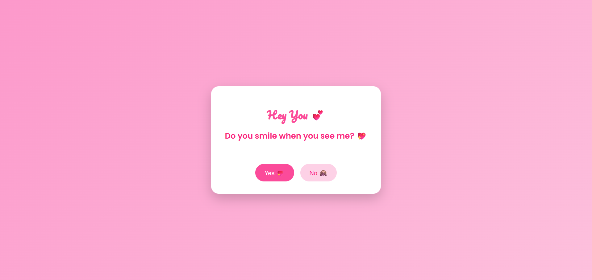
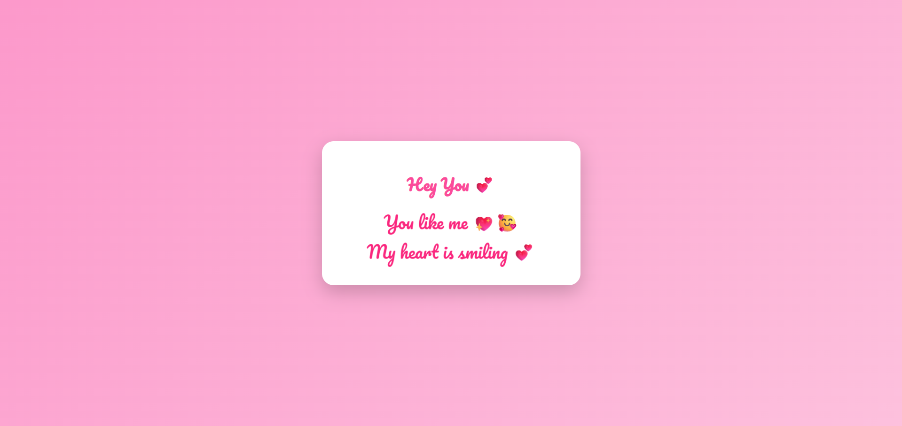

# 💗 Crush Confession 💗

A sweet, romantic, and interactive web experience made especially for your crush. This project presents cute Yes / No
questions, displayed one by one with big fonts, emojis, and a beautiful pink-themed design. It’s emotional journey where
your crush clicks their answers, and at the end, the page reveals a lovely message saying “You like me 💖” or “You don’t
like me 💔” in a soft and respectful way.

## 🛠️ Technologies

✅ HTML 
✅ CSS 
✅ JS 
✅ jQuery 

## 🚀 Features

✅ Pink-themed romantic UI with smooth gradients and soft colors. 
✅ Cute Crush Questions displayed one-by-one. 
✅ Big fonts, emojis, and playful buttons for a lovely experience. 
✅ Yes / No interaction with smooth fade animations. 
✅ Beautiful final message screen with heart-touching text. 
✅ Fully responsive (works on mobile and desktop). 

## 📸 Screenshots

### Questions

### Result

## 📝 Version

**1.0.0**

## 📬 Get in Touch

Encountered any issues, or want to learn more about the project? Reach out directly:

📧 [kavithmathushal9007@gmail.com](mailto:kavithmathushal9007@gmail.com)

#### This project is licensed under the [GNU License](LICENSE)

#### © 2026 All Rights Reserved | Designed by [Kavithma Thushal](https://github.com/Kavithma-Thushal)

