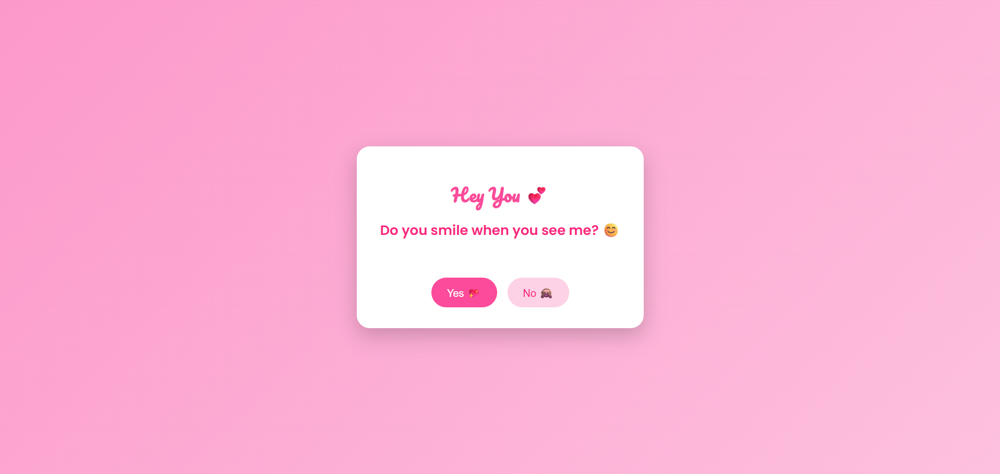

# 💗 Crush Confession 💗

A sweet, romantic, and interactive web experience made especially for your **crush** 💕This project presents **5 cute
Yes / No questions**, displayed **one by one** with big fonts, emojis, and a beautiful pink-themed design. It’s not a
form — it’s a fun, emotional journey where your crush clicks their answers, and at the end, the page reveals a lovely
message saying **“You like me 💖”** or **“You don’t like me 💔”** in a soft and respectful way.

This project is designed to express feelings creatively using simple web technologies and animations.

## 🛠️ Technologies

✅ HTML 
✅ CSS 
✅ JS 

## 🚀 Features

✅ Pink-themed romantic UI with smooth gradients and soft colors. 
✅ 5 Cute Crush Questions displayed one-by-one (not a form). 
✅ Big fonts, emojis, and playful buttons for a lovely experience. 
✅ Yes / No interaction with smooth fade animations. 
✅ Automatic result decision based on answers. 
✅ Beautiful final message screen with heart-touching text. 
✅ Fully responsive (works on mobile and desktop). 

## 📸 Screenshots

### Welcome Screen

### Question Screen

### Final Result

## 📝 Version

**1.0.0**

## 📬 Get in Touch

Have suggestions, ideas, or want to improve this project? Feel free to reach out:

📧 [kavithmathushal9007@gmail.com](mailto:kavithmathushal9007@gmail.com)

#### This project is licensed under the [GNU License](LICENSE)

#### © 2025 All Rights Reserved | Designed by [Kavithma Thushal](https://github.com/Kavithma-Thushal)

#### 💗 This project was made with feelings, creativity, and a little courage 💗

